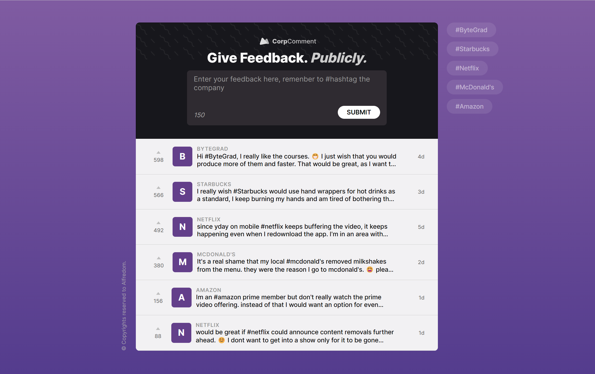

# CorpComment App

An experiment built in React and Typescript to test and play with modern web technologies.



## Running locally

1. Install dependencies

```sh
npm install
```

2. Run the application

```sh
npm run dev
```

## Features

- [x] List feedback
  - Loads data from a server
- [x] Create feedback
  - Saves data to a local server
  - Validates user feedback input
  - Signals user if registration is successfull or unsuccessfull
  - Hide error messages after 2 seconds
- [x] Upvote feedback
  - Send PATCH request to a server
- [x] Filter feedback by company name

## Branches

- main
- version/only-props
- version/with-zustand

To contrast the code between branches, run the command bellow:

```sh
git checkout <branch-name>
```

## Dependencies

- React
- Zustand
- json-server
